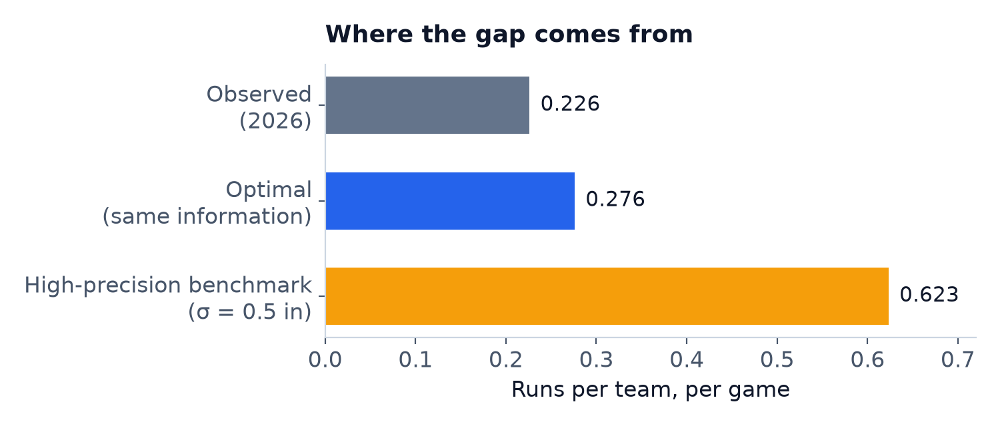
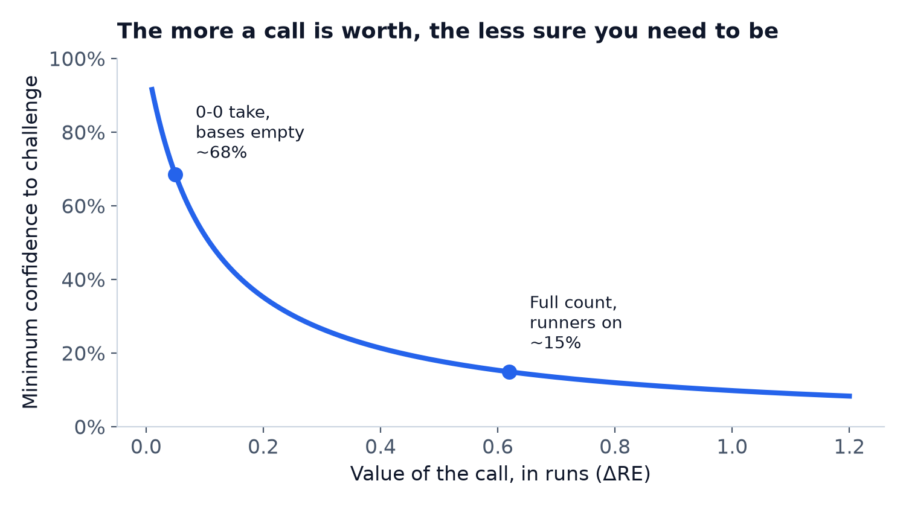
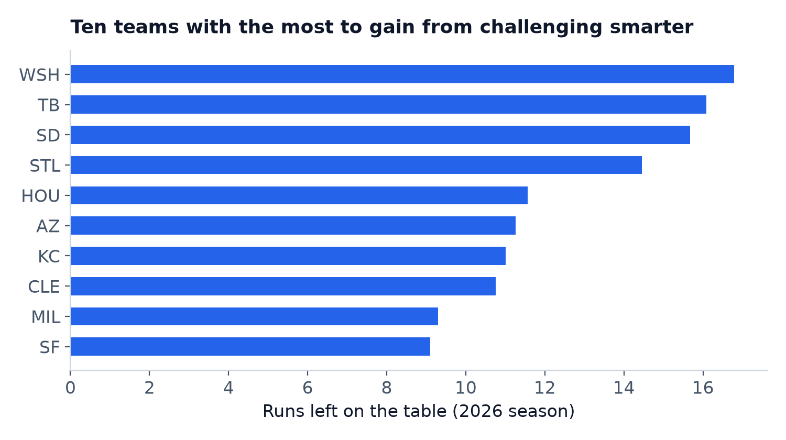
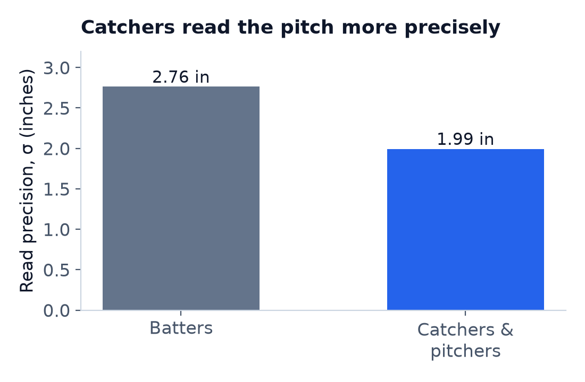

# The Coin-Flip Problem: What MLB's ABS Challenge System Is Really Worth

**Live app:** [mlb-abs-challenge-analysis.streamlit.app](https://mlb-abs-challenge-analysis.streamlit.app)
**Code and data pipeline:** [github.com/Cowshal/mlb-abs-challenge-analysis](https://github.com/Cowshal/mlb-abs-challenge-analysis)

2026 is the first season Major League Baseball has let players challenge ball
and strike calls. Each team gets two challenges a game, and can ask for an
instant review of a close call. Here's the rule that makes this interesting,
and the one I want you to sit with before reading anything else: **a correct
challenge is given back.** Only a wrong one costs you. A team that keeps
winning its challenges never runs out.

Given that, look at how players are actually behaving. Across 9,037
challenges in the 2026 season, the league-wide success rate is 53.7%. Just
above a coin flip.

That number should bother you. If challenging is free until you're wrong, a
coin-flip success rate isn't evidence that players are well calibrated — it's
evidence they're leaving value on the table. Under a resource with this kind
of asymmetric cost, you don't wait until you're sure. You fire whenever
you're more likely right than the downstream cost of occasionally being
wrong. The breakeven point isn't 50%. It should usually be a lot lower,
especially early in a game when both challenges are still in hand.

So I set out to answer: how much are teams actually leaving on the table, and
why? Getting there meant answering a much more basic question first — one I
assumed I already knew the answer to, and didn't.

## The detour that mattered

To value a challenge, you need to know, for any given pitch, the probability
it would actually be overturned. That means knowing exactly where the ABS
zone's edges are and exactly where the pitch crossed them — precisely, not
approximately, because the calls worth challenging are by definition the
close ones.

The zone itself is simple: 17 inches wide, top at 53.5% of the batter's
height, bottom at 27%. The complication is the ball. A pitch is a strike if
*any part* of the ball — not its center — crosses the zone. I knew that rule
existed. I didn't expect how much it would matter until I checked.

I pulled every 2026 challenge where MLB had published `edge_distance` — the
system's own measurement of how far a pitch was from the boundary — and
compared it to what you'd get by treating the ball as a point at its center.
Restricted to calls that were genuinely close (within one ball's radius of
the boundary — half the season's challenges), classifying by the center
instead of the edge got two out of every three calls wrong. Not a rounding
error. A coin flip you'd lose more often than win. Once I added the radius
correction, the fit against MLB's own numbers came back exact to five decimal
places, matching a real baseball's radius almost to the millimeter.

That fact wasn't hidden. It was checkable in an afternoon. It hadn't been
checked, at least not in the material I was handed. That's the real theme of
this project: at almost every step, the gap between "commonly assumed" and
"actually true" was one measurement away.

## How you measure what a player could see

Here's the part I'm most proud of, because the obvious approach is wrong in a
way that's easy to miss.

Once I had the true zone geometry, I could compute whether any pitch was
really a ball or a strike. But that's not what a player is deciding from. A
player is judging a pitch crossing the plate at 95 mph, from twenty feet away
or from behind a catcher's mask, in real time. To model the *decision*, I
needed to know how good that judgment actually is — how much noise sits
between the true pitch location and what a player perceives.

The tempting way to estimate that noise is to look at how often players are
right. If perceptual noise were high, you'd expect a lower success rate; if
low, a higher one. Fit the noise parameter to match the observed 53.7%
success rate, and you're done.

That's exactly wrong, and worth explaining why. The whole question I'm trying
to answer is whether players' *decisions* are good, given their information.
If I estimate their information by assuming their decisions are already
optimal — which is what fitting noise to the success rate does, implicitly —
I've built a model that can never find a decision-making gap. It answers the
question by assuming the answer.

So I estimated it a different way: from *where* players chose to challenge,
never from how often they were right. If a player had perfect information,
you'd never see anyone challenge a pitch sitting comfortably in the middle of
the strike zone — there'd be nothing to gain. Every real challenge on a pitch
that wasn't actually close is direct evidence of how much noise is in a
player's read. Fit a noise parameter to the *shape* of that distribution —
how often, and how far, players challenge pitches that turn out not to be
borderline at all — and you get an estimate with no way to know in advance
what success rate it implies.

The result: batters read a pitch's location with about 2.75 inches of noise;
catchers and pitchers, about 2.0 inches. Here's the check that convinced me
this wasn't a coincidence. Without ever showing the model the league's actual
success rate by role, it reproduced it almost exactly — predicting 48.9% for
batters and 57.9% for catchers and pitchers, against the real 45% and 59%. A
model told nothing about outcomes landed within a few points of both,
approaching from opposite directions, using only where people chose to
challenge. That's not the kind of agreement you get by accident.

## The finding

With true geometry and honest perceptual noise in hand, I could finally
answer the original question: solve for the optimal policy, using the same
imperfect information a player actually has, and compare it to what teams
are doing.

Teams currently challenge about 2.1 times a game and win 53.7% of the time,
netting an estimated 37 runs per team over a season. The optimal policy,
given identical information, challenges more — about 2.9 times a game — and
wins a *smaller* share: 43.3%. It still comes out ahead, at roughly 46 runs
per team-season, a gap of about 10 runs.

That's the headline, but the mechanism is the interesting part, and it isn't
what you'd guess. The optimal policy isn't winning by challenging more often
on the same kinds of pitches. It's winning by challenging *different*
pitches — ones worth more when you're right. The average run value of an
optimal challenge is about 20% higher than the average value of an actual
one. It's the challenge equivalent of a hitter trading batting average for
slugging: fewer hits, more total bases, a better outcome overall.

This falls directly out of the asymmetry in the rules. Because a correct
challenge is free, the breakeven confidence for firing depends entirely on
how much the call is worth.

A full-count pitch with runners on base, where the call decides a walk versus
a strikeout, is worth roughly 0.6 runs if you get it right — that's the
average number of runs a team can expect to score from that point in the
inning onward, which is what "worth" means throughout this analysis. It's
valuable enough that you should challenge it at 15% confidence, with both
challenges in hand. A first-pitch take with the bases empty is worth a few
hundredths of a run — you shouldn't challenge that one unless you're almost
certain, north of 70%. Those two numbers are more than four times apart. A
player using one fixed gut-feel threshold across every situation is, by
construction, wrong most of the time.

The gap isn't spread evenly across the league. Some teams are much closer to
optimal than others, and the ones farthest away have the most to gain from
changing nothing but which pitches they challenge.

## The counterintuitive one

The batter/catcher split in challenge success is public and well known:
batters succeed on about 45% of their challenges, catchers and pitchers on
about 59%. The usual read is that fielders are simply better at this —
sharper judgment, maybe more reps on borderline calls.

The model says that's mostly an information story, not a decision-quality
one. Catchers and pitchers see the pitch from directly behind the plate;
batters see it from the side — arguably the worst seat in the house for
judging a pitch's horizontal location.

That gap in vantage point — a measured 28% difference in perceptual noise —
is enough to explain most of the success-rate gap on its own.

Here's the part that's easy to miss with a slightly different modeling
choice: because catchers and pitchers have better information, the model
says they should be challenging *more* often than batters, not less —
despite already succeeding more often. Better information makes more calls
worth acting on, not fewer.

This result depends entirely on treating the two roles' noise separately.
Pool them into one league-wide estimate — a reasonable-looking
simplification — and the conclusion flips: a pooled model says batters
should challenge more. Any analysis that fits a single noise parameter
across both roles will get this backwards, with no way to tell from the fit
alone that it's happened.

## A repeatable skill, or just who was on the roster?

Once you can rank teams by runs left on the table, the obvious next move is
to publish the leaderboard and let people argue about who's good at this.
Before doing that, I tried to break it.

So I ran the actual test: split each team's season by date and correlate
first-half success rate
against second-half. If challenge accuracy is a real, stable team skill,
teams that are good in April through June should still be good in July
through September. Across all 30 teams, the correlation came back at
r = 0.24, 95% confidence interval −0.14 to 0.55. That interval contains
zero. I can't call this a repeatable skill from that number alone, and I'm
not going to round it up to one because a leaderboard is more satisfying
than an unresolved question.

It isn't simple noise either. Simulating 30 league-average teams at each
team's real attempt count, the spread you'd expect from binomial chance
alone is smaller than the spread MLB teams actually showed in 2026 — for
both success rate (p = 0.003) and runs gained (p < 0.0001). One team,
Cincinnati, sits 3.4 standard deviations above the league rate, a gap that
survives a Bonferroni correction for having checked all 30 teams
(p ≈ 0.02). There is more real variation across teams than chance alone
produces. It just isn't the kind of variation that clearly carries over
from one half of a season to the other.

The split-half test also has an answer at the wrong level. Rosters change
mid-season — trades, call-ups, injuries — so a real, stable trait belonging
to individual players can still fail a team-level reliability check if the
players carrying it move around during the season. I re-ran the same
split-half test on individual challengers instead of teams. At a minimum of
8 challenges per half (108 players), the correlation is r = 0.28
(p = 0.003, 95% CI 0.10–0.45); at a minimum of 10 (84 players), r = 0.37
(p < 0.001, CI 0.17–0.54) — both clearly above the team-level 0.24 and,
unlike it, comfortably clear of zero. Looser or stricter thresholds are
noisier (5 challenges: r ≈ 0; 15 challenges: r = 0.25 but only 51 players
left, p = 0.08), which is what small samples do rather than a real reversal.

That points at personnel, not front offices — and it lines up with which
teams' edges are quality-driven versus volume-driven. Cincinnati's lead is
almost entirely quality, and its primary catcher, Tyler Stephenson,
individually ranks in the 85th percentile of all catchers leaguewide on his
own challenge success (69% on 123 attempts). Colorado, also quality-driven,
has a similarly sharp catcher (80th percentile). Minnesota and Chicago's
leads are volume stories instead — more attempts at average or
below-average success rates — and their primary catchers grade out as
merely average or below (60th and 13th percentile). A team doesn't need an
exceptional catcher to lead the league if it's winning on attempt volume
rather than hit rate, and that's the split the data actually shows.

None of this proves an organizational skill — one season still can't
distinguish "genuinely better process" from "happened to roster the right
people this year" — but it does resolve the apparent contradiction: the
spread across teams is real, it fails a team-level reliability check
because it isn't a team-level trait, and it passes a player-level one
because that's the level it actually lives at. Read the team table as a
snapshot of who was on which roster in 2026, not as a ranking of front
offices.

## What I'd want that I don't have

Three things would sharpen this considerably. The first is per-player noise,
rather than one number per role — a 28% gap between roles almost certainly
hides real variation between individual players, and a team could act on
that directly. The second is a win-probability objective instead of runs;
the model right now is indifferent to score, so it values a close-game
challenge the same as one in a blowout, which isn't how anyone actually
values one. The third is simply a second season of ABS data, to turn the personnel-level
reliability above into a genuine year-over-year test rather than a
within-season split. 2026 is the system's first year, and some of what
looks like a stable pattern could still be first-year unfamiliarity working
itself out.

## Limitations, honestly

Two of these matter enough to affect the headline number in a specific,
known direction.

The perceptual-noise estimate is fit with a single confidence threshold per
role. Real players almost certainly vary their threshold by count and game
situation, and that variation looks exactly like noise to an estimator that
isn't told about it — which means my noise estimate is inflated, and the
coachable gap I'm reporting (10 runs) is a floor, not a point estimate.
Letting the threshold vary by count would tighten it, probably upward.

Second, this model is built entirely on data MLB's own tracking system
produced, checked against arithmetic built from that same system. That's a
real test of internal consistency — it's how I caught the ball-radius rule
and confirmed the geometry — but it can't tell me how accurate MLB's cameras
are in any absolute sense, because there's no independent measurement
anywhere in the pipeline to check against. Any claim about a
"perfect-information" ceiling is therefore an assumption, not a measurement,
and I've reported it as a range rather than a single number for that reason.
